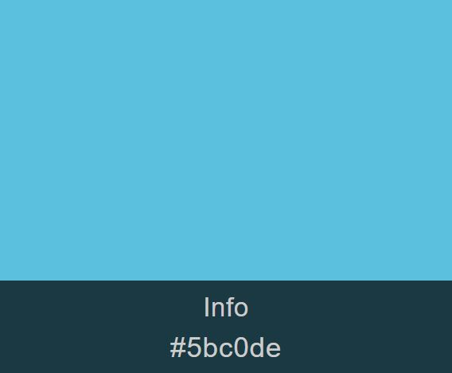
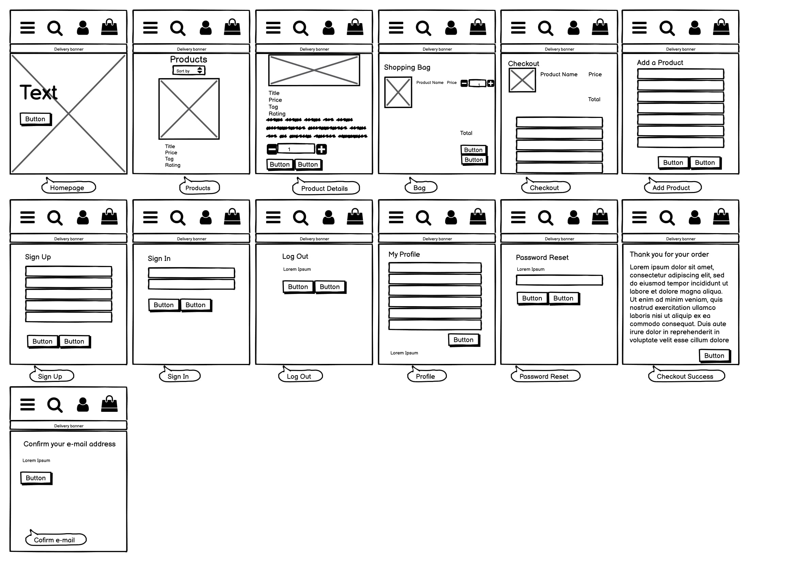
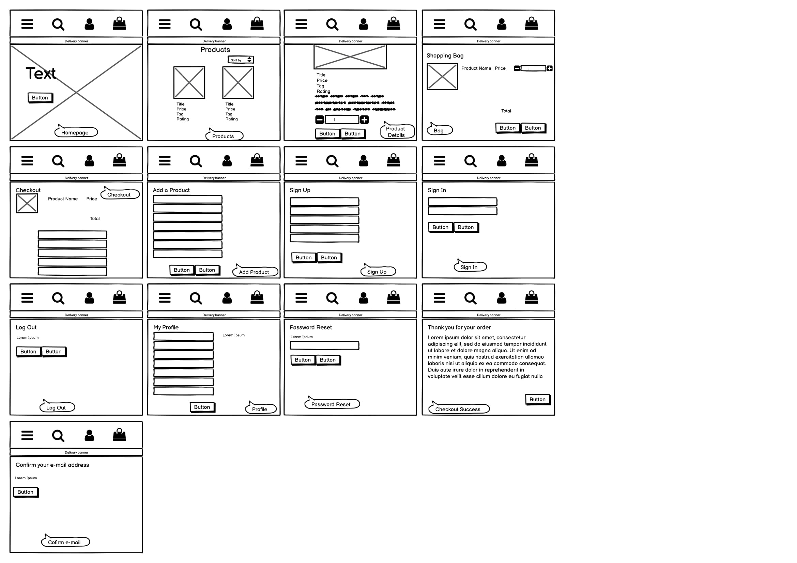
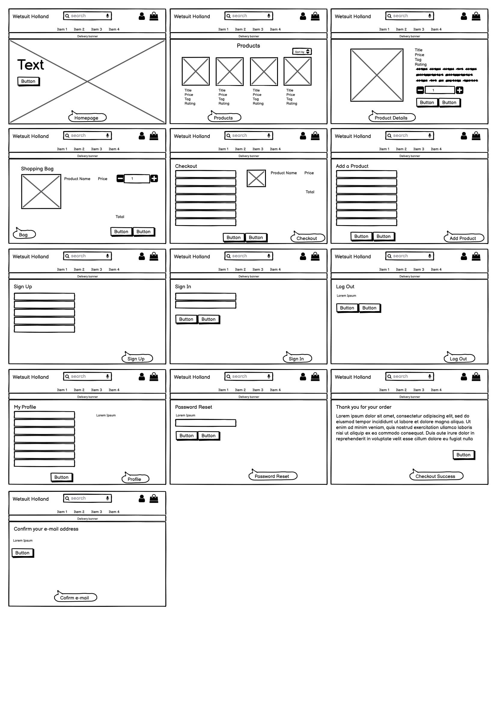

# Wetsuit Holland
This is an e-commerce website for selling wetsuits. The users can search in multiple ways on the website, create an account and purchase a wetsuit.

# Deployed Site
[Wetsuit Holland Website](http://wetsuit-holland.herokuapp.com/)

# UX
## User Stories
Viewing and Navigation by Shopper
- View a list of all the products
- View individual product details
- Quickly identify different type of products
- See the total amount in my shopping bag
Registration and User Accounts by Site User
- Easily register for an account
- Receive an email confirmation after registering
- Easily login or logout
- Easily recover my password
- Have a personalized user profile
Sorting and Searching by shopper
- Sort the list of available products
- Sort a specific category of products
- Sort multiple categories of products simultaneously
- Search for a product by name or description
- Easily see what i’ve searched for and the number of results
Purchasing an Checkout by shopper
- Easily select the quantity of a product when purchasing it
- View items in my bag to be purchased
- Adjust the quantity of individual items in my bag
- Easily enter my payment information
- View an order confirmation after checkout
- Receive an email confirmation after checking out
Admin and Store Management by store owner
- Add a new product
- Edit a product
- Delete a product

## Strategy
This website is designed so users can search through the products and sort them in multiple ways.
All the products all displayed together and by clicking on a product they can read the product details and add the product to their bag.
When a product is added, the user can checkout to complete the order by filling in a form.
The user has the option to register and to login to an account.
On this website the admin has the option to use add, edit and delete a product.

## Scope
All the folders:
- bag: for users to see what is in their bag
- checkout: with all the information before and after placing the order
- home: the landing page where users can select how to view the products
- wetsuit_holland: the Python code for this website
- media: the images used on the website
- products: a page with all the products and to view each product with more details
- profiles: personal information and order history of registered users
- templates:
  - The Base Page: with the whole navbar
  - The Navbar Pages: for displaying the navbar depending on the screen size
  - The Toasts: the pop-ups with extra information
  - The Allauth Pages: for all logging options
- static: the base static file

## Structure
- Header:
  - Top-navbar onlarge devices: on the left the title, in the middle the searchbar and on the right the menu items:
  - My Account & Bag
  - The My Account dropdown menu will change, depending on if the user is logged out, logged in or it’s the admin
- The Shopping Cart will change, depending on if the Bag is empty or filled
- Main-navbar on large devices: with the menu categories in dropdown menu
- Navbar on small & medium devices:
  - Icon with dropdown menu: home & categories, each category has it's own dropdown menu
- My Account dropdown menu will change, depending on if the user is logged out, logged in or it’s the admin
- Shopping Cart will change, depending on if the Bag is empty or filled
- Bottom Menu: message
- Landing Page: text and button to go to all the products
- Signup Page: form field with buttons
- Login Page: form field with buttons and checkbox
- Profile Page: form field with buttons + order history
- Logout Page: buttons
- Password Reset Page: form field with buttons
- Add Product Page: form field
- Edit Product Page: form field with checkbox
- Products Page: all products
- Product Page: product details
- Bag Page: button + added product
- Checkout Page: buttons

## Skeleton
- Main Nav Menu:
  - All Products is a collapsible menu: by Price, by Rating, by Category & all Products
    - Fullsuitis a collapsible menu: Mystic, Neilpryde, Prolimit & all Fullsuit
    - Shortarm is a collapsible menu: Mystic, Neilpryde, Prolimit & all Shortarm
    - Shorty is a collapsible menu: Mystic, Neilpryde, Prolimit & all Shorty
- Top Nav:
  - Title: link to homepage (large device) or Home: link to homepage (medium/small devices)
  - Searchbar: searches through all wetsuits
  - My Account icon with dropdown menu:
    - Logged out user: Register, Login
    - Logged in user: My Profile, Logout
    - Logged in admin: Product Management, My Profile, Logout
  - Bag icon link to bag page
- Delivery banner: text info
- Homepage: button with link to all products page
- Signup:
- Form field: e-mail address, e-mail address confirmation, username, password, password confirmation
- Buttons: back to login, sign up
- Login:
  - Form field with: e-mail address, password
  - Checkbox: remember me
  - Buttons:  home, sign in
- Password Reset:
- Form field: e-mail address
- Button:  back to login, reset my password
- Logout buttons: cancel, sign out
- Profile:
- Form field: phone number, street address 1, street address 2, town or city, country, state or locality, postal code, country dropdown menu (all the countries included)
- Button: update information
- Overview order history:
- Add Product:
- Form field: category dropdown menu, sku, product name, product description, sizes dropdown menu, rating, image url
- Button: select image, cancel, add product
- Edit Product: form field, the same as add product. Extra option: checkbox: remove image
- Confirm E-mail: Button with confirm
- Toasts: to display messages as pop ups on every page using django messages module, with messages for most actions across the website.

## Surface
- Font Family text font: standard
- Background color: white
- Home Page background: full image
- Color schema: black & blue <br>
<br>
- Top-navbar:
- Text color: black
- Text color inside searchbar: light grey
- Background color: white
- Icons: black
- Header top-navbar and main-navbar on medium and small devices:
  - Text color: black
  - Text color inside searchbar: light grey
  - Background color: white
  - Icons color: black
- Main-navbar:
  - Text color: black
  - Text color inside searchbar: light grey
  - Background color collapsible product menu:
  - Background color collapsible Search and My Account icons: white
  - Icons color: black
- Shopping Cart Icon when filled: blue
- Delivery banner:
- Text color: white
- Background color:black
- Home Page:
  - Full page image
  - Button: black, white text
  - Button hover over:
- Sign Up Page:
  - Background: white
  - Title: dark grey
  - Form: black borders, light grey text
  - Button 1: white with black border, black text
  - Button 2: black, white text
- Login Page:
  - Background: white
  - Title: dark grey
  - Form: white with black borders, light grey text
  - Checkbox: unchecked
  - Button 1: white with black border, black text
  - Button 2: black, white text
- Profile Page:
  - Background: white
  - Title: dark grey
  - Form: white with black borders, light grey text
  - Button: black, white text
- Logout Page:
  - Background: white
  - Title & text: dark grey
  - Button 1: white with black border, black text
  - Button 2: black, white text
- Password Reset Page:
  - Background: white
  - Title & text: dark grey
  - Form: white with black borders, light grey text
  - Button 1: white with black border, black text
  - Button 2: black, white text
- Bag Page:
  - Background: white
  - Title & text: dark grey
  - Button: black, white text
  - Add Product Page:
  - Background: white
  - Form: white with black borders, light grey text
  - Button 1: black, white text
  - Button 2: white with black border, black text
  - Button 3: black, white text
- Edit Product Page:
  - Background: white
  - Form: white with black borders, light grey text
  - Checkbox: red, unchecked
  - Button 1: black, white text
  - Button 2: white with black border, black text
  - Button 3: black, white text
- Products Page:
  - Background: white
  - Sort menu: white with black border, grey text
  - Back to top icon: white with black border and arrow
  - Product: image, dark grey price/title/tag/rating
  - Light grey horizontal border between the products
- Product Detail Page:
  - Background: white
  - Image: aligned whole left site on larger devices, aligned on top on smaller devices
  - Title/price/tag/rating/product information: dark grey
  - Quantity: left the minus icon, middle the quantity, right the plus icon
  - Button 1: white with black border, black text
  - Button 2: black, white text
- Checkout Page:
  - Background: white
  - Form: white with black borders, light grey text
  - Button 1: white with black border, black text
  - Button 2: black, white text
  - Order Summary with the products added to the bag:
  - Product Image
  - Product text: dark grey
  - Product value: black
- Checkout Success Page
  - Background: white
  - Title & text: dark grey
  - Button: black, white text
  - Confirm Email Page:
  - Background: white
  - Title & text: dark grey
  - Button: black, white text

## Mockups
The following wireframes were created using Balsamiq to design the website layout options:
<br>
<br>
<br>

# Features
The webpage consists of the following features:
- Header
  - The title is a link to the Home Page
  - The search bar, searches through all the products
  - My Account icon is a collapsible menu with multiple options, depending on the user is logged out, logged in or the admin
    - Logged out user:
      - Register will lead to the Sign Up Page
      - Login will lead to the Login Page
    - Logged in user:
      - Profile will lead to the Sign Up Page
      - Logout will lead to the Logout Page
    - Admin:
      - Product Management will lead to the Add Product Page
      - Profile will lead to the Profile Page
      - Logout will lead to Logout Page
   - The Shopping Cart icon will lead to the Bag Page
  - Product Navbar will lead to the Product Page, sorted by the way the user selected  
- Home Page
  - The button is a link to an overview of all the products    
- Products Page
  - In the right top a collapsible menu to sort the products
  - 1, 2, 3 or 4 products horizontal alligned, depending on device size
  - The Admin has the option to edit or delete the product
- Product Detail Page:
  - Option to ascend or descend the quantity of the product
  - A Continue Shopping button, which will lead to the Product Page
  - A add to Bag button:
    - Will lead to the Confirm-Email Page
    - Toast will appear with:
      - The added product
      - When the order total is underneath the $50,- a message will show up with how much more to spend to get free delivery
      - A Go to secure checkout button, which will lead to the Bag page
    - For the admin:
      - Option to edit or delete the product
      - Edit link will lead to the Edit Product Page
      - Delete link:
        - Product will deleted from the database
        - Toast will appear
        - Admin will be directed to the Product Page
- Bag Page:
  - Option to ascend or descend the quantity of the product with an option to update or remove the product
    - Remove link:
      - Lead to updated bag page
      - Toast will appear
  - Continue Shopping button which will lead to the Product Page
  - Secure Checkout button which will lead to the Checkout Page
- Checkout Page:
  - A form with fields for the personal details, the delivery details and the creditcard number, which are all required
  - A link to Create an account, which will link to the Sign Up Page
  - A link to Login, which will link to the Login Page
  - An overview with all the products in the bag
  - An Adjust Bag Button, which will lead to the Bag Page
  - A Complete Order button, which will lead to the Checkout Success Page
- Checkout Success Page:
  - Overview of the order
  - A Back to the Shop button, which will lead to the Product Page
  - Toast will appear
- Sign Up Page:
  - A form with required fields
  - A link to the Login Page
  - A Back to Login button, which will lead to the Login Page
  - A Sign Up Button, when pressed:
    - The form will give an error when a field is filled in incorrect
    - Will lead to the Confirm Email Page
    - Toast will appear
- Confirm Email Page:
  - A page with text to go to your E-mail provider
  - In Email provider click the link to confirm e-mail address
  - Will lead to the Confirm Email Page now with Button to Confirm
  - Confirm button will lead to the Login Page
  - Toast will appear
- Login Page
  - A link to the Signup Page
  - A form with required fields
  - A checkbox the remember the information in the required fields
  - A Home button, which will lead to the Home Page
  - A Sign In button, when pressed:
    - The form will give an error when a field is filled in incorrect
    - Will lead to the Home Page
    - Toast will appear
  - A link to the Password Reset Page
- Profile Page:
  - A form with all the user details
  - An Update Information button to add/edit the form information
  - The order history
- The Logout Page:
   - A Cancel button, which will lead to the Home Page
   - A Sign Out button, which will lead to the Home Page
   - Toast will appear
- Add Product Page by admin:
  - Category is a collabsible menu
  - The form fields are required
  - A Select Image button will pop-up the users explorer to select an image
  - A Cancel button will lead to the Products Page
  - A Add Product button will send the new product to the database and will lead the admin to the Product Detail Page of the added product
  - Toast will appear
- Edit Product Page by admin:
  - Category is a collabsible menu
  - The form fields are required
  - A Checkbox to remove the image
  - A Select Image button will pop-up the users explorer to select an image
  - A Cancel button will lead to the Products Page
  - A Update Product button will send the edited product to the database and will lead the admin to the Product Detail Page of the edited product
  - Toast will appear

## Features left to implement
- Social Media account login

# Technologies
- __HTML5__ was used as the main language for the templates
- __CSS__ was ued for styling the webpage
- __JavaScript__ was used for some front end functionality
- __Python3__ was used for backend data manipulation
- __Github__ was used for version control
- __Gitpod__ to build the website
- __Django__ was used as as a python based web framework
- __Django Allauth__ for the authentication system
- __Django Countries__ which was used for the country field for user to be able to selct the contry they are from
- __Django Crispy__ Forms to helps to manage the forms and able adjust forms properties in the backend
- __Gunicorn__ (‘Green Unicorn’) is a pure-Python WSGI server for UNIX
- __Pillow__ to be able to use the image field for the products on the site
- __Stripe__ to set up the payment methods for the site as customer can pay by card
- __Bootstrap__ for responsive simplistic layouts
- __JQuery__ for the JavaScript in the website
- __Font Awesome__ to add the icons used in the site
- __Amazon AWS__ for storing media and static files for use on my Heroku site
- __Autopep8__ to tidy up my python code
- __SQLite 3__ for the database which stores the information from my site e.g. products, users
- __W3C Markup__ was used this to check my HTML for errors and typos
- __W3C CSS__ was used to check the validity of my CSS
- __Google Chrome Developer Tools__ for testing different divice sizes
- __Fontawesome__ was used for some icons on the website

## Deployment

### Store static files and images on AWS
1. Go to aws.amazon.com there create an account and follow the steps or log in.
2. Once logged in search for S3 and open it and create a new bucket and give it a name. to keep it simple I gave it my Heroku app name, taste-world-snacks. Then select the region that is close to you, uncheck block all public access and acknowledge that the bucket will be public. It needs to be public to allow public access to our static files. Then click create bucket.
3. The new bucket needs a few basic settings.
    - To do that select your bucket, go to properties tab, look for static website hosting and click edit and click on enable and host a static website. I used index.html and error.html as index and error documents. As this is for educational use so I can go with defaults.
    - Then go to the permission tab, from there the cors configuration tab and click edit. I pasted in the Cors configuration provided by school. This is to setup the required access between our Heroku app and this S3 bucket.
    - Then under the policy tab in the permission tab select policy generator to create a security policy for the bucket. The policy type is S3 bucket policy, effects will be allow, principal will be , action will be get object and the ARN you can find on top of the bucket policy tab. Click add statement, then generate policy. Copy this policy into the bucket policy editor and add a / on to the end of the resource key to allow all access to all resources in the bucket and finally click save. Leave the policy generate window open for when you will create a user.
    -As the last step go to the access control list tab and select public access to everyone, select list and understand the effects and save.

### Setup user to access bucket
1. Go back to the server menu and open I am. Click on groups, create a new group and give it a name. To keep it simple I gave it the name manage-taste-world-snacks. Then click on create group.
2. To make a policy to use to access our bucket click on policies and then create policy. Go to the JSON tab, click on import managed policy, search for S3, choose AmazonS3FullAccess and import. As I only want full access to the bucket and everything in it, you will go to the policy generate page that you left open and copy the ARN behind resource. You can paste this in the list behind resource and in a second line past it in again but with /* behind it. Click review policy, give it a name and description and click create policy. I name mine taste-world-snacks and as description, I added to access S3 bucket for taste world snacks static files.
3. You will attach the policy to the group you just created. To do so go to groups, click on the group that was just made, click attach policy, search for the policy with the name that you just made, select it and click attach policy.
4. Then finally you will create a user to put in the group. Click on users page, click add user and give it a name. I called it taste-world-snacks-staticfiles-user. select programmatic access as access type, click next, select your group, click through till the end and then click create user. Download the CSV file with the user access key and secret key and click close. It is very important to download and save this file as it cannot be downloaded or accessed again.

### Connect S3 bucket to Django
1. In the code editor install bato 3, django-storages and freeze them. Add storages in settings.py under installed apps. -pip3 install bato 3, pip3 install django-storages, pip3 freeze > requirements.txt
2. You need to add the next settings under the media root section of settings.py to tell it with which bucket to communicate with. Add an if statement to check if there is an environment variable called use aws and give it these variables with the corresponding values:
```bash
  if 'USE_AWS' in os.environ:
      AWS_STORAGE_BUCKET_NAME,
      AWS_S3_REGION_NAME,
      AWS_ACCESS_KEY_ID = os.environ.get('AWS_ACCESS_KEY_ID'),
      AWS_SECRET_ACCESS_KEY = os.environ.get('AWS_SECRET_ACCESS_KEY'),
      AWS_S3_CUSTOM_DOMAIN = f'{AWS_STORAGE_BUCKET_NAME}.s3.amazonaws.com'
```
3. Then go to Heroku settings tap and reveal config vars to add:
```bash
AWS_ACCESS_KEY_ID
AWS_SECRET_ACCESS_KEY
USE_AWS with value True
```
4. You can find the credentials in the CSV file you downloaded from AWS and remove the DISABLE COLLECTSTATIC variable.
5. In your code editor create a file named custom_storages.py to tell Django where to store static files and uploaded product images when you run collect static files. In this file you import settings from django.config and import S3Boto3Storage from storages.backends.s3boto3. Add a class to tell Django where to store static files and another for where to store media files.
```bash
  from django.conf import settings
  from storages.backends.s3boto3 import S3Boto3Storage

  class StaticStorage(S3Boto3Storage):
      location = settings.STATICFILES_LOCATION

  class MediaStorage(S3Boto3Storage):
     location = settings.MEDIAFILES_LOCATION
```
6. Then go back to settings.py to tell it that for static file storage you want to use the StaticStorage class, for media files you want MediaStorage and what location it should save them.
```bash
  STATICFILES_STORAGE = 'custom_storages.StaticStorage'
  STATICFILES_LOCATION = 'static'
  DEFAULT_FILE_STORAGE = 'custom_storages.MediaStorage'
  MEDIAFILES_LOCATION = 'media'
```
7. You also need to override and explicitly set the URLs for static and media files using your custom domain and new locations.
```bash
  STATIC_URL = f'https://{AWS_S3_CUSTOM_DOMAIN}/{STATICFILES_LOCATION}/'
  MEDIA_URL = f'https://{AWS_S3_CUSTOM_DOMAIN}/{MEDIAFILES_LOCATION}/'
```

### Adding other files to S3 bucket
1. You can add an extra setting to the use aws if statement in settings.py, that will tell the browser that it is okay to cache static files for a long time.
```bash
AWS_S3_OBJECT_PARAMETERS = {
  'Expires': 'Thu, 31 Dec 2099 20:00:00 GMT',
  'CacheControl': 'max-age=94608000',
  }
```
2. To add media files to your S3 bucket, you need to go back to awsamazon.com, open S3, open your bucket, click on create folder and give it a name. I called mine media. Open this folder, click upload then click on add files, then select all the images you want to select and click upload. If you have your images on Github than download them first from there and make sure that you add your images in with the same path as in your local database, example images/image.jpg.

### Forking the GitHub Repository
By forking the GitHub Repository we make a copy of the original repository on our GitHub account to view and/or make changes without affecting the original repository by using the following steps...
1. Log in to GitHub and locate the GitHub Repository
2. At the top of the Repository (not top of page) just above the "Settings" button on the menu, locate the "Fork" button.
3. You should now have a copy of the original repository in your GitHub account.

### Making a Local Clone
1. Navigate to https://github.com/remcokes/wetsuit_holland.
2. Click the green 'Clone or Download' button.
3. Copy the URL in the dropdown box.
4. Using your favourite IDE open up your preferred terminal.
5. Navigate to your desired file location.
6. Copy the following code and input it into your terminal to clone Cook with me.
7. git clone https://github.com/remcokes/wetsuit_holland.git
```bash
$ git clone https://github.com/YOUR-USERNAME/YOUR-REPOSITORY
```
8. Press Enter. Your local clone will be created.
```bash
$ git clone https://github.com/YOUR-USERNAME/YOUR-REPOSITORY
> Cloning into `CI-Clone`...
> remote: Counting objects: 10, done.
> remote: Compressing objects: 100% (8/8), done.
> remove: Total 10 (delta 1), reused 10 (delta 1)
> Unpacking objects: 100% (10/10), done.
```

## Credits

### Content
- <a href="https://www.kater.nl/" target="_blank">Kater</a> for the product info

### Media
- <a href="https://www.pixabay.com/" target="_blank">Pixabay</a> for the home page image
- <a href="https://www.kater.nl//" target="_blank">Kater</a> for the wetsuit images
- <a href="https://www.fontawesome.com/" target="_blank">Fontawesome</a> for some free icons
- <a href="https://www.garyshood.com/" target="_blank">Garyshood</a> to resize the images

### Acknowledgements
- Code Institute Course
- YouTube
- Slack Community